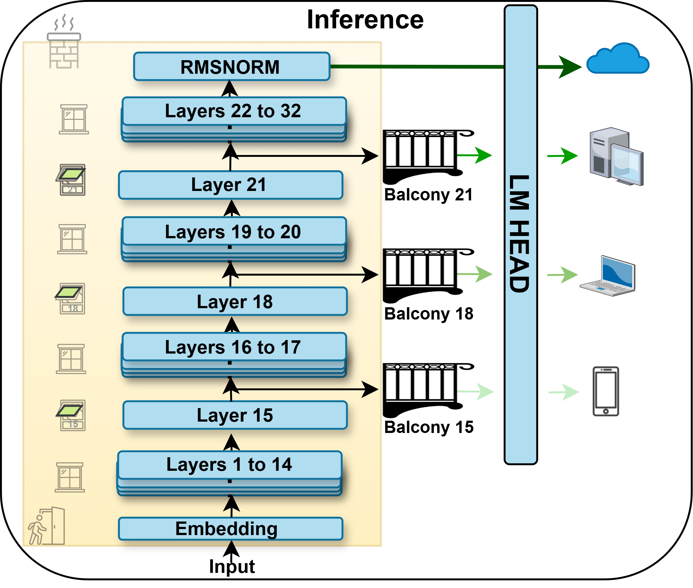
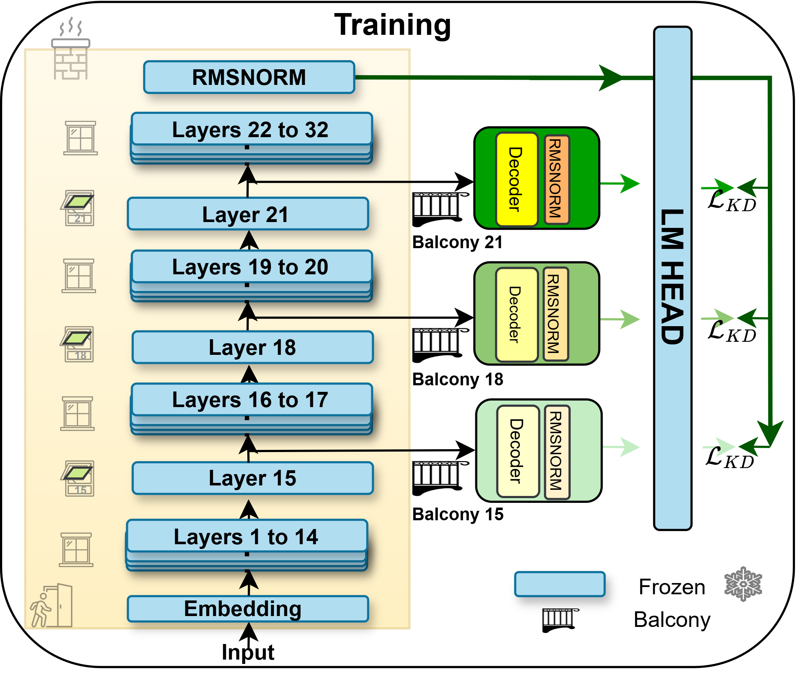

# Balcony-LLaMA

<a target="_blank" href="">
</a>
<a target="_blank" href="https://github.com/benyaminjami/Balcony-LLaMA">
</a>
<a target="_blank" href="https://huggingface.co/collections/TIGER-Lab/acecoder-67a16011a6c7d65cad529eba">
</a>
<!-- <a target="_blank" href="https://twitter.com/DongfuJiang/status/1805438506137010326">
</a> -->
<br>


## Abstract

Balcony-LLaMA introduces an innovative approach to Large Language Model (LLM) inference by implementing early exit mechanisms at strategic layers of transformer-based models. By allowing the model to exit computation early for simpler queries while utilizing the full network depth for complex tasks, Balcony-LLaMA achieves significant computational efficiency without sacrificing performance quality. This project specifically targets the Llama family of models, demonstrating how adaptive computation can be effectively applied to state-of-the-art LLMs.

## Introduction

Large Language Models have demonstrated remarkable capabilities across various natural language tasks, but their computational demands present challenges for widespread deployment. Balcony-LLaMA addresses this challenge by introducing "balconies" - early exit points strategically placed at different transformer layers. These balconies enable dynamic computation paths based on input complexity, potentially reducing inference time and computational costs for simpler queries.

<div align="center">

<p><em>Figure 1: Balcony-LLaMA architecture with early exit points at intermediate transformer layers.</em></p>
</div>

## Method

Balcony-LLaMA implements early exit mechanisms by:

1. Adding prediction heads ("balconies") at configurable intermediate layers of the transformer architecture
2. Training these exit points to make accurate predictions for appropriate inputs
3. Implementing decision mechanisms to determine whether to exit early or continue processing through deeper layers
4. Optimizing the balance between computational efficiency and model performance

The implementation supports various configurations, including:
- Flexible placement of exit points at different layers
- Attention-based and MLP-based exit mechanisms
- Frozen or unfrozen base model weights
- Meta-learning approaches for optimizing exit behavior

### Training Process

<div align="center">

<p><em>Figure 2: Training process for Balcony-LLaMA. The model is trained with multiple exit heads simultaneously, with knowledge distillation from the final layer to earlier exit points.</em></p>
</div>

During training, we optimize both the early exit modules. The training process involves:

1. Forward pass through the base model up to the final layer
2. Computing losses at each exit point
3. Applying knowledge distillation from the final layer to earlier exit points

### Inference Process

During inference, the model:

1. Processes input through transformer layers sequentially
2. At each exit point, computes a prediction and confidence score
3. If confidence exceeds a threshold, exits early with the current prediction
4. Otherwise, continues processing through deeper layers
5. Tracks exit statistics to analyze model behavior

## Implementation

Balcony-LLaMA is implemented using the Hugging Face Transformers library and supports the Llama model family, with specific optimizations for Llama-3.1. The codebase includes:

- Training scripts with DeepSpeed Zero-3 optimization
- YAML-based configuration system for experiment management
- Wandb integration for experiment tracking


### Project Structure

```
Balcony-LLaMA/
├── finetuning/                # Fine-tuning code
│   ├── train.py               # Main training script
│   ├── metatoken_learning.py  # Meta-learning implementation
│   ├── train_config.py        # Training configuration utilities
│   ├── kd_trainer.py          # Knowledge distillation trainer
│   └── transformers_extra/    # Extensions to transformers library
├── experiments/               # Experiment configurations
│   ├── balcony_llama.yaml     # Configuration for Llama with balconies
│   ├── balcony_attention.yaml # Attention-based exit experiments
│   ├── balcony_mlp.yaml       # MLP-based exit experiments
│   ├── balcony_unfrozen.yaml  # Experiments with unfrozen weights
│   └── meta_balcony.yaml      # Meta-learning approaches
├── logs/                      # Training logs
├── wandb/                     # Weights & Biases logs
├── train.sh                   # Training launcher script
├── requirements.txt           # Project dependencies
├── deepspeed_zero3.yaml       # DeepSpeed configuration
└── ddp.yaml                   # Distributed training configuration
```

## Experimental Setup

Experiments are configured through YAML files that specify:
- Base model (e.g., meta-llama/Llama-3.1-8B-Instruct)
- Exit layer placement (e.g., layers 15, 18, 21)
- Training parameters (learning rate, batch size, sequence length)
- Optimization strategies (frozen layers, specific unfrozen components)

Example configuration from `experiments/balcony_llama.yaml`:

```yaml
# Model arguments
model_name_or_path: meta-llama/Llama-3.1-8B-Instruct
decontaminate: false
torch_dtype: bfloat16

dataset_mixer:
  HuggingFaceTB/smollm-corpus: 1.0
dataset_configs: 
- cosmopedia-v2
dataset_splits:
- train
preprocessing_num_workers: 64
load_from_disk: hf_cosmo/

bf16: true
do_eval: false
gradient_accumulation_steps: 16
gradient_checkpointing: false

learning_rate: 5.0e-04
log_level: info
logging_steps: 10
logging_strategy: steps
lr_scheduler_type: cosine
max_seq_length: 4096
max_steps: 30000
num_train_epochs: 1
output_dir: /work/parsa/checkpoints/llama_8B_balcony_layers_15_18_21_gradNorm/
overwrite_output_dir: true
per_device_train_batch_size: 2
push_to_hub: false
remove_unused_columns: true
packing: true
report_to:
- none
save_strategy: "steps"
save_steps: 2000
save_total_limit: 10
seed: 42
warmup_ratio: 0.01
kl_weight: 1.0
ce_weight: 0.0

freeze_model: true
meta_training: false
tie_exit_lm_head: true
output_exit_layers:
  - 15
  - 18
  - 21
output_full_model: true
exit_layer_indices: 
  - 15
  - 18
  - 21
exit_decoder_layer: true
unfreeze_layers:
  - "exit_modules" # Only unfreeze the exit module layers
```

The project includes various experimental configurations exploring different aspects of early exit mechanisms:
- Basic balcony configurations
- Attention-based exits
- MLP-based exits
- Unfrozen model variants
- Meta-learning approaches

## Usage

For a complete list of dependencies, see the `requirements.txt` file.

### Installation

```bash
git clone https://github.com/yourusername/Balcony-LLaMA.git
cd Balcony-LLaMA
pip install -r requirements.txt
```

### Training

To train a model with balcony layers, use the provided training script:

```bash
bash train.sh experiments/balcony_llama.yaml
```

This will launch training with DeepSpeed Zero-3 optimization and log the results to the specified output directory.

### inference

```python
from transformers import AutoModelForCausalLM, AutoTokenizer
from transformers_extra import *
# Load the model with balcony exits
model_path = "path/to/saved/balcony_llama"
exit_layer = 12 # The layer index of desired exit balcony
tokenizer = AutoTokenizer.from_pretrained(model_path)
model = AutoModelForCausalLM.from_pretrained(model_path, output_exit_layers=exit_layer)

# Generate text with early exits
input_text = "Translate the following English text to French: 'Hello, how are you?'"
inputs = tokenizer(input_text, return_tensors="pt")
outputs = model.generate(**inputs, max_length=100)
print(tokenizer.decode(outputs[0]))
```

## Conclusion

Balcony-LLaMA demonstrates that early exit mechanisms can be effectively applied to large language models, offering a promising approach to reducing the computational demands of these powerful systems without significantly compromising their capabilities. This work contributes to ongoing efforts to make advanced AI systems more efficient and accessible.

## Future Work

- Exploration of dynamic routing strategies between exit points
- Application to multimodal models
- Optimization for specific deployment scenarios
- Integration with quantization techniques for further efficiency
- Extending the approach to other model architectures beyond Llama

## Acknowledgements

This project builds upon the work of the Llama model family by Meta AI and incorporates techniques from various research papers on early exit mechanisms for transformer models.


## Citation

If you use Balcony-LLaMA in your research, please cite:

```bibtex
#TODO: fill here
```

## License

This project is licensed under the terms of the license included in the repository.

## Contact

For questions or issues, please open an issue on the GitHub repository or contact the authors directly.
